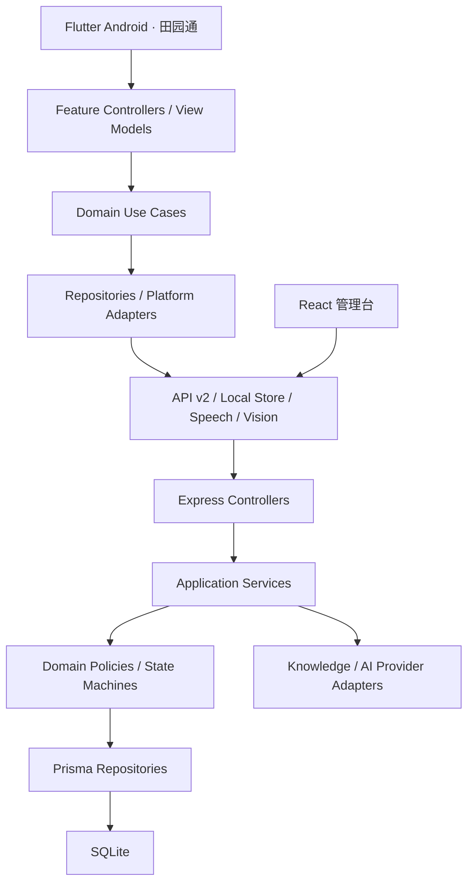

# 116 - 田园通大重构总计划

> 状态：方案已冻结，等待用户明确“开工”  
> 正式基线：`0b23591f`  
> 推荐方案：渐进式领域重构  
> 预计交付：2026 年 9 月比赛前  
> 本文件只定义范围与执行方式，不代表已经实施。

## 1. 配套文档

- [116a-大重构决策记录.md](116a-大重构决策记录.md)：冻结的产品与技术决策。
- [116b-大重构三档方案对比.md](116b-大重构三档方案对比.md)：方案比较和推荐理由。
- [116c-大重构风险报告.md](116c-大重构风险报告.md)：P0/P1/P2 风险与闸门。
- [117-大重构需求问卷.md](117-大重构需求问卷.md)：第一轮需求答案。
- [117a-大重构第二轮决策问卷.md](117a-大重构第二轮决策问卷.md)：第二轮决策答案。

## 2. 总目标

将田园通从“功能数量多、模块成熟度不一、页面与控制器高度耦合”的项目，重构为一套适合比赛稳定演示、面向农户使用、具备可信业务闭环和技术深度的 Android 数字农业应用。

### 2.1 评委可见结果

- 打开 App 后快速理解“田园通解决什么问题”。
- 农产品交易和 AI 植保两条头牌链路稳定、完整、可重复。
- 村级经营、农机、政策、防灾四条链路有真实状态和历史记录。
- 语音助手在断网 APK 中可用，关键写操作有二次确认。
- 数据和演示结果稳定可复现，不出现随机行情、随机金额或假实时结论。
- 评委追问安全、权限、数据一致性、AI 降级和部署时有清楚答案。

### 2.2 用户可见结果

- App 只呈现“田园通”正式品牌。
- 页面不出现比赛、Demo、开发中、占位、临时实现等措辞。
- 首页和导航围绕农户任务组织，不再宣传功能数量。
- 适老、暗色、错误态、空状态、加载态和无障碍行为一致。

### 2.3 工程结果

- Flutter 和后端按领域形成稳定模块边界。
- API v2 有统一契约，App 不在 Widget 深处解析任意动态 Map。
- 核心写操作有事务、状态机、权限和审计。
- SQLite 有正式 migration、备份、恢复、唯一约束和必要关系。
- 核心链路具备自动测试、E2E、真机验收和 CI。
- 每个里程碑可以独立验收和回滚。

## 3. 范围

### 3.1 六条核心链路

1. 农产品交易。
2. AI 植保。
3. 村级经营。
4. 农机服务。
5. 惠农政策。
6. 防灾救助。

### 3.2 公共能力

- 认证、角色、区域权限。
- 首页、搜索、发布、消息、个人中心和设置。
- 小田语音助手。
- 图片与附件。
- 数据备份、种子数据、操作日志和管理台。

### 3.3 辅助能力

- 乡村生活：邻里互助、就业信息、环境反馈。
- 设备沙盘：固定、可复现的仿真设备状态和安全联动。

### 3.4 不在本轮范围

- Vue/Capacitor 迁移。
- iOS 和平板专项适配。
- 微服务、Docker、PostgreSQL、Redis、消息队列。
- 真实支付和真实 IoT 硬件接入。
- 公网 SaaS 商业化和完整多租户计费。
- 让本地大语言模型成为核心演示依赖。
- 比赛前重写所有历史数据表和所有辅助页面。

## 4. 产品信息架构

### 4.1 底部导航

建议固定为五项：

1. 首页。
2. 集市。
3. 发布。
4. 小田助手。
5. 我的。

消息通过顶栏铃铛进入；“全部服务”删除；村级经营按角色从首页进入。

### 4.2 首页

首页按以下顺序组织：

1. 品牌、用户问候、消息入口。
2. 当前最重要事项。
3. 两个头牌入口：农产品交易、AI 植保。
4. 村级经营、农机、政策、防灾四条主路径。
5. 邻里互助、就业、环境反馈、设备沙盘等辅助入口。
6. 与当前角色相关的最近记录。

不显示“69/71/76 个功能”等数量卖点。

### 4.3 角色可见性

| 能力 | FARMER | BIGFARMER | VILLAGE | EXPERT | MERCHANT | ADMIN |
|---|---:|---:|---:|---:|---:|---:|
| 农产品购买 | ✅ | ✅ | ✅ | ✅ | ✅ | ✅ |
| 商品发布/卖家订单 | 可申请 | ✅ | - | - | ✅ | ✅ |
| AI 植保 | ✅ | ✅ | ✅ | ✅ | ✅ | ✅ |
| 村级经营 | - | - | 本区域 | - | - | 全部 |
| 农机预约 | ✅ | ✅ | ✅ | ✅ | ✅ | ✅ |
| 政策申请 | ✅ | ✅ | ✅ | ✅ | ✅ | ✅ |
| 灾情/SOS | ✅ | ✅ | ✅ | ✅ | ✅ | ✅ |
| 角色授予 | - | - | - | - | - | ✅ |

最终权限以 116e 权限矩阵工作单为准，所有后端服务必须执行同一矩阵。

## 5. 目标架构



### 5.1 Flutter 目录目标

```text
app/lib/
  app/                 # 启动、路由、依赖组合根
  core/                # API、错误、存储、主题、平台能力
  design_system/       # token、基础组件、状态组件
  capability/          # 单一能力注册表
  features/
    auth/
    market/
      data/
      domain/
      presentation/
    plant_care/
    village/
    machinery/
    policy/
    disaster/
    assistant/
    profile/
```

实施原则：

- 不先全局迁移状态管理；以 market 样板验证后再决定 Provider 是否足够。
- `ApiClient`、本地存储、语音和识图都通过接口注入。
- DTO 与领域模型分离，禁止新页面直接深层解析 `Map<String, dynamic>`。
- 页面只负责展示和交互，不直接承担事务、缓存、同步和状态机。

### 5.2 后端目录目标

```text
backend/src/
  routes/v2/
  modules/
    market/
      market.routes.js
      market.controller.js
      market.service.js
      market.repository.js
      market.policy.js
      market.schemas.js
    ...
  contracts/           # OpenAPI 与统一 schema
  infrastructure/      # Prisma、文件、日志、AI Provider
  middleware/          # 单次认证、权限、限流、错误处理
```

实施原则：

- 保持 JavaScript ESM，比赛前不做全量 TypeScript 迁移。
- controller 只负责参数适配和响应，不直接编排多表业务。
- 事务、状态转换、权限和区域隔离进入 application/domain service。
- 通用管理 CRUD 不得绕过核心领域规则。

### 5.3 单一能力注册表

注册表至少包含：

- 稳定 capability id。
- 用户可见名称、别名和搜索关键词。
- Flutter route。
- 允许角色。
- 首页、搜索、助手、发布和管理台中的可见性。
- 对应 API capability key。
- 是否需要联网、相机、麦克风或其它平台能力。

路由、搜索、语音助手、功能入口和 API 开关不再维护互相独立的镜像清单。

## 6. AI 与语音目标架构

### 6.1 比赛断网路径

```text
用户问题/语音
  → 离线 STT
  → 本地意图解析
  → 白名单业务命令 或 知识检索
  → 规则化回答/页面导航/二次确认
  → 设备 TTS
```

### 6.2 AI 植保路径

```text
图片
  → 质量检查
  → 轻量任务模型
  → 置信阈值
  → 病害知识库与处置规则
  → 农事记录
  → 复查提醒
```

### 6.3 Provider 策略

- 本地大语言模型不是启动必需项。
- 云 Provider 默认关闭，业务数据不自动外发。
- 管理员明确开启云 Provider 时，需要提示数据边界并执行脱敏。
- 规则和知识检索是正式降级路径，不在 UI 中称为“离线兜底”。
- system prompt 允许管理台配置，数据库自定义值优先；必须提供“恢复默认”和版本信息。

### 6.4 语音安全

- 导航、搜索、朗读可以直接执行。
- 下单、支付、SOS、提交申请、修改状态必须二次确认。
- 设备沙盘不允许通过自然语言执行高风险动作。
- 所有命令有白名单、参数 schema、超时和操作日志。

## 7. 数据设计目标

### 7.1 核心约束

- 订单号、追溯码等使用可碰撞安全的生成策略。
- `localUuid` 全局唯一，并由数据库约束。
- 核心外键增加关系和索引。
- 订单、库存、物流和日志写入使用事务。
- 同步业务写入和同步日志使用事务。
- 预约确认检查时间重叠。
- 所有核心状态使用显式状态机和角色动作权限。

### 7.2 附件

统一附件实体保存：

- 文件名和存储路径。
- MIME、大小和哈希。
- 所有者和业务归属。
- 创建时间、删除时间和安全处理状态。

旧 JSON 图片字段在过渡期只读兼容，完成迁移后删除写入路径。

### 7.3 备份与恢复

- migration 前生成带时间戳的 SQLite 备份。
- 备份写入项目外明确目录，不进入 Git。
- 提供校验、恢复和过期清理命令。
- 比赛前完成一次真实“备份 → 升级 → 恢复”演练。

## 8. 比赛展示脚本

### 8.1 三分钟主脚本

| 时间 | 操作 | 评委看到的价值 |
|---|---|---|
| 0:00～0:20 | 启动广告/引导 → 农户登录 | 品牌、完成度、正式产品感 |
| 0:20～1:15 | 浏览商品 → 立即购买 → 支付成功 → 订单状态 | 完整交易闭环和真实数据状态 |
| 1:15～2:15 | 拍照植保 → 处置建议 → 农事记录 → 复查提醒 | AI 与农业任务真正结合 |
| 2:15～2:40 | 语音打开功能、查询记录或导航 | 适老、离线语音和业务编排 |
| 2:40～3:00 | 切换村级经营或管理台 | 区域权限、数据汇总和平台完整性 |

### 8.2 稳定性要求

- 每个步骤可重复执行，不依赖随机值。
- 关键数据由种子脚本准备，支持一键恢复。
- AI 识别不确定时走诚实的规则路径，不能卡死。
- Ollama、公网、Web 语音全部不可用时，主脚本仍能完成。
- 演示前提供自动预检，检查后端、数据库、磁盘、模型、麦克风和 APK 版本。

## 9. 实施里程碑

### M0 - 基线封存与特征测试

**目标**：在不丢失当前 WIP 的前提下建立干净重构基线。

**主要范围**：

- 记录当前 dirty tree 的文件清单、diff stat 和责任归属。
- 用户授权后保存 WIP 到可恢复分支或工作树。
- 从 `0b23591f` 创建 `codex/refactor-*` 分支。
- 固定 Flutter、Dart、Node、npm、Java、Python 版本。
- 补登录、首页、交易、AI、看板的 characterization tests。
- 建立根目录统一验证入口和基线报告。

**重点文件**：`.gitignore`、根级脚本、`app/test/`、`backend/test/`、管理台测试目录、docs。

**验收**：新分支干净；WIP 可恢复；所有基线命令有明确成功或已知失败记录。

**回滚**：删除新分支即可，原 WIP 不受影响。

### M1 - 身份、安全与运行配置

**目标**：关闭所有身份和配置 P0。

**主要范围**：

- 公开注册固定 FARMER。
- 管理员角色授予和初始化命令。
- 管理台一次性密码重置验证码。
- dev/demo/release 环境校验和强密钥。
- 单次 Token 解析、rotation、撤销和设备管理。
- 移动端安全存储、管理台安全 Cookie。
- 上传格式、大小、解码、重编码、EXIF 和配额。
- CORS、限流来源和审计日志脱敏。

**重点文件**：

- `backend/src/modules/platform/auth.controller.js`
- `backend/src/modules/platform/platform.routes.js`
- `backend/src/middleware/auth.js`
- `backend/src/config/index.js`
- `backend/src/middleware/upload.js`
- `app/lib/core/auth_state.dart`
- `backend/admin/src/` 登录与权限相关文件

**验收**：注册提权、验证码重放、默认密钥、跨角色、恶意上传测试通过。

**回滚**：保留旧登录响应兼容层；安全修复不允许回退到已知漏洞行为。

### M2 - API v2、契约与能力注册表

**目标**：建立新旧结构共存的稳定边界。

**主要范围**：

- 建立 `/api/v2` 路由骨架和统一响应。
- 建立 OpenAPI、参数 schema、分页和错误码规则。
- 建立 Flutter typed DTO、ApiGateway 和 Repository 接口。
- 建立单一能力注册表。
- 管理台 API 目录从契约生成或读取。
- v1 进入受控兼容期，不在此阶段删除。

**重点文件**：

- `backend/src/routes/index.js`
- `backend/src/utils/response.js`
- `backend/src/middleware/error.js`
- `backend/admin/src/apiCatalog.js`
- `app/lib/core/api_client.dart`
- `app/lib/core/feature_catalog.dart`
- `app/lib/core/router.dart`
- `app/lib/widgets/voice_assistant_layer.dart`

**验收**：契约测试通过；App 样板请求使用 typed DTO；注册表能驱动路由、搜索和助手别名。

**回滚**：v1 保持可用，新 v2 可以按模块关闭。

### M3 - SQLite、事务与同步一致性

**目标**：关闭数据损坏和越权风险。

**主要范围**：

- 建立正式 migration 基线和自动备份。
- 核心表补关系、唯一约束和索引。
- 修复 `localUuid` 所有者边界、幂等和事务。
- 建立订单事务和状态机。
- 建立农机预约确认冲突规则。
- 通用管理 CRUD 禁止直接编辑领域状态。
- 一次性启动修复迁出 server bootstrap。

**重点文件**：

- `backend/prisma/schema.prisma`
- `backend/prisma/migrations/`
- `backend/src/modules/data/sync.controller.js`
- `backend/src/modules/market/order.controller.js`
- `backend/src/modules/machinery/booking.controller.js`
- `backend/src/modules/platform/resource.controller.js`
- `backend/src/server.js`

**验收**：旧库升级、全新 seed、恢复、并发下单、重复同步、跨用户同步和预约冲突测试通过。

**回滚**：自动恢复迁移前备份；每个 migration 有回退说明。

### M4 - Flutter 应用基座与设计系统

**目标**：建立后续页面迁移的统一壳层。

**主要范围**：

- 新五项底部导航和角色化首页。
- 删除“全部服务”入口，消息改铃铛入口。
- 建立语义化颜色、字号、间距、圆角、阴影和动效 token。
- 建立暗色主题、适老主题和无障碍基础组件。
- 建立统一 Loading、Empty、Error、Unauthorized、Offline/ServiceUnavailable 状态。
- 建立平台能力接口和依赖组合根。
- 所有整页改动先截图确认。

**重点文件**：

- `app/lib/main.dart`
- `app/lib/core/theme.dart`
- `app/lib/core/router.dart`
- `app/lib/pages/home/shell_page.dart`
- `app/lib/pages/home/home_page.dart`
- `app/lib/widgets/common.dart`

**验收**：411×731 和 1080×1920 无溢出；亮/暗/适老可切换；键盘、读屏和触控基线通过。

**回滚**：新旧壳层通过 feature flag 切换，直到用户截图验收完成。

### M5 - 头牌一：农产品交易领域样板

**目标**：用交易链路完成第一条端到端领域重构。

**主要范围**：

- Product、Order、Inventory、PaymentResult、Logistics typed model。
- 商品浏览、搜索、详情、库存校验。
- 模拟支付成功的明确状态和幂等。
- 买卖双方状态动作、库存事务和订单历史。
- 买家/卖家/管理员权限。
- Flutter market 纵向切片、API v2、后台领域命令。

**重点文件**：

- `app/lib/pages/market/`
- 新 `app/lib/features/market/`
- `backend/src/modules/market/`
- `backend/admin/src/pages/ResourcePage.jsx` 及订单专用页面

**验收**：并发防超卖、重复支付幂等、非法状态拒绝、取消回补、完整 E2E 和 APK 真机通过。

**回滚**：market v2 能单独关闭并临时回到 v1 只读路径。

### M6 - 头牌二：轻量 AI 植保与语音助手

**目标**：在断网且无本地大语言模型时稳定完成 AI 主脚本。

**主要范围**：

- 对 2～3 个轻量识别候选进行本机 spike。
- 建立图片质量检查、置信阈值和“不确定”状态。
- 建立来源可追踪的病害知识和处置规则。
- 识别结果写农事记录并创建复查提醒。
- 助手拆为 IntentRouter、CommandRegistry、KnowledgeSearch、ProviderAdapter。
- sherpa 模型打入 arm64/x86_64 对应 APK。
- 导航、查询、写操作二次确认、TTS 打断和回声防护。
- 云 Provider 保留配置但默认关闭。

**重点文件**：

- `app/lib/pages/agri/photo_flow_page.dart`
- `app/lib/pages/ai/ai_chat_page.dart`
- `app/lib/widgets/voice_assistant_layer.dart`
- `app/lib/core/offline_stt*.dart`
- `app/lib/core/tts_service.dart`
- `backend/src/modules/agri/detect.controller.js`
- `backend/src/modules/ai/`
- `app/assets/models/`

**验收**：

- Ollama 和公网关闭时完整脚本通过。
- 固定植保评测集正确率达到工作单定义阈值，低置信结果诚实拒答。
- 首次可见反馈小于 2 秒，常规结果小于 10 秒，30 秒硬超时。
- arm64 APK 小于 600MB，真机离线 STT/TTS 通过。

**回滚**：识别模型和规则包均版本化；失败可回到上一模型和规则版本。

### M7 - 其余四条核心链路

**目标**：完成村级经营、农机、政策、防灾的状态与权限闭环。

**主要范围**：

- 村级经营：区域聚合、ADMIN/VILLAGE 边界、指标来源和看板稳定性。
- 农机：浏览、预约申请、机主确认、重叠检查、提醒、完成记录。
- 政策：权威快照、统一 AI 问答、材料附件、申请、审核、消息。
- 防灾：预警、上报、SOS、理赔、处理进度和历史。

**重点文件**：

- `app/lib/pages/data/`
- `app/lib/pages/machinery/`
- `app/lib/pages/policy/`
- `app/lib/pages/disaster/`
- 对应 `backend/src/modules/*/`

**验收**：每条链路包含加载、空、错误、提交成功、历史、再次操作和权限失败状态；E2E 与真机通过。

**回滚**：按领域独立 feature flag 和 v1 兼容路径回滚。

### M8 - 辅助能力、管理台与演示数据

**目标**：收口辅助能力和评委追问所需后台证据。

**主要范围**：

- 邻里互助、就业信息、环境反馈。
- 设备沙盘固定状态和可复现联动。
- 管理台角色授予、验证码、数据导入、审核、日志、模型/规则版本。
- 权威行情/政策/知识快照导入。
- 完整演示故事 seed 和一键恢复。
- 用户可见品牌统一为“田园通”，技术标识逐步统一为 FarmLink。

**验收**：种子重建后主脚本数据一致；管理台所有核心操作有审计；UI 无穿帮文案。

**回滚**：辅助能力可以单独隐藏，不影响六条主路径。

### M9 - 比赛发布与回归

**目标**：生成可重复交付的比赛版本。

**主要范围**：

- CI、覆盖率、依赖/secret 扫描、视觉和无障碍回归。
- 正式 Android 签名、版本号、校验和、回滚 APK。
- 一条启动命令、自动预检、健康检查。
- arm64 真机和 x86_64 模拟器矩阵。
- 3 分钟主脚本、失败替代路径和答辩材料。
- 数据备份恢复演练。
- README、部署、发布、架构和维护文档收口。

**验收命令目标**：

```powershell
# Flutter
& 'C:\dev\flutter\bin\flutter.bat' pub get
& 'C:\dev\flutter\bin\flutter.bat' analyze lib
& 'C:\dev\flutter\bin\flutter.bat' test

# 后端与管理台（对应 scripts 建立后）
npm ci --prefix backend
npm run verify --prefix backend
npm ci --prefix backend/admin
npm run verify --prefix backend/admin

# 全项目
.\scripts\verify-all.ps1
.\scripts\build-apk.ps1 -Mode release
```

最终还必须完成真机人工验收，不能只以命令通过代替产品验收。

## 10. 计划排期与截止线

按单人开发估算：

| 周期 | 目标 | 截止线 |
|---|---|---|
| 第 1 周 | M0～M2：基线、安全、v2 骨架 | 未关闭 P0 不进入视觉重写 |
| 第 2 周 | M3～M4：数据一致性、App 基座 | 新壳层截图确认后继续 |
| 第 3 周 | M5：交易头牌 | 必须形成稳定可演示版本 |
| 第 4 周 | M6：AI 植保与语音 | 断网真机为唯一完成标准 |
| 第 5 周 | M7：其余核心链路 | 优先村级经营，其次农机/政策/防灾 |
| 第 6 周 | M8～M9：后台、数据、发布硬化 | 冻结功能，只修阻断问题 |

如果比赛早于上述周期：

1. 必须保留 M0～M6 和 M9。
2. M7 只保证村级经营，其余链路保留现有稳定流程。
3. M8 的生活辅助、设备沙盘、Git 历史瘦身和 Linux 自动化延期。

## 11. 性能与质量预算

| 指标 | 目标 |
|---|---:|
| 普通交互反馈 | < 300ms |
| 本机非 AI API P95 | < 500ms |
| AI 首次可见反馈 | < 2s |
| 常规 AI/植保结果 | < 10s |
| AI 硬超时 | 30s |
| 冷启动到业务首屏 | < 3s（不含用户主动停留的广告） |
| arm64 release APK | < 600MB |
| 自动化覆盖率 | ≥ 60% |
| 核心页面尺寸 | 411×731、1080×1920 无溢出 |

## 12. 工作单拆分规则

开工后，每个里程碑必须再拆成独立工作单，至少包含：

- 目标与评委可见结果。
- 文件级改动清单。
- API 和数据契约。
- migration 与回滚。
- 测试和真机步骤。
- 不在范围内。
- 实施备注。

建议后续编号：

- `116d`：M0 基线与特征测试。
- `116e`：M1 身份、安全与权限矩阵。
- `116f`：M2 API v2 与能力注册表。
- `116g`：M3 SQLite、事务与同步。
- `116h`：M4 Flutter 基座与设计系统。
- `116i`：M5 农产品交易领域。
- `116j`：M6 AI 植保与语音。
- `116k`：M7 其余核心链路。
- `116l`：M8 管理台与演示数据。
- `116m`：M9 比赛发布与回归。

## 13. 开工条件

本计划完成不代表自动开工。必须同时满足：

1. 用户明确回复“开工”。
2. 用户确认当前 WIP 的保存方式。
3. 用户确认比赛日期或至少确认当前排期可用。
4. M0 工作单完成并通过基线闸门。

在此之前，不允许清理、提交、切换或覆盖当前业务代码改动。
